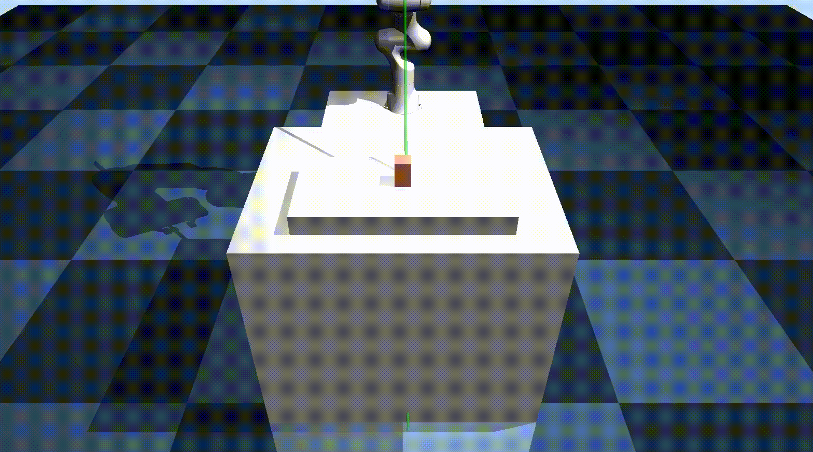

# Franka Panda Pick-and-Place with MuJoCo

A comprehensive implementation of robotic manipulation using the Franka Panda robot in MuJoCo physics simulator. This codebase demonstrates autonomous pick-and-place operations using inverse kinematics (IK) and PID control.

## Table of Contents
- [Overview](#overview)
- [Project Structure](#project-structure)
- [Core Components](#core-components)
- [Installation](#installation)
- [Usage](#usage)
- [Technical Details](#technical-details)
- [Code Architecture](#code-architecture)
- [References](#references)

---

## Overview

This project implements a complete robotic manipulation pipeline for pick-and-place tasks using the Franka Panda robot arm. The system combines:

- **Inverse Kinematics (IK)**: Computes joint configurations for desired end-effector poses
- **PID Control**: Tracks target joint positions with smooth trajectory execution
- **MuJoCo Simulation**: Provides realistic physics simulation and visualization
- **Task Sequencing**: Automates multi-step manipulation tasks

The main demonstration performs a cyclic pick-and-place task where the robot:
1. Moves to pre-grasp position
2. Rotates end-effector to align with objects
3. Descends to grasp position
4. Closes gripper to grasp object
5. Lifts object to pre-grasp height
6. Rotates to placement location
7. Descends to place position
8. Opens gripper to release object
9. Repeats for multiple objects



---

## Project Structure

```
mujoManipulation-legacy/
├── pnp.py                          # Main pick-and-place demo script
├── get_grasp_pose_using_ik.py      # IK solver for grasp pose computation
├── requirements.txt                 # Python dependencies
├── README.md                        # This file
│
├── src/                            # Core library modules
│   ├── mujoco_parser.py            # MuJoCo environment wrapper
│   ├── ik_module.py                # Inverse kinematics solver
│   ├── PID.py                      # PID controller implementation
│   └── util.py                     # Utility functions (transforms, math)
│
├── asset/                          # MuJoCo model assets
│   ├── panda/                      # Franka Panda robot models
│   │   ├── franka_panda.xml        # Basic robot model
│   │   ├── franka_panda_w_objs.xml # Robot with objects for PnP
│   │   ├── meshes/                 # 3D mesh files
│   │   └── assets/                 # Additional assets
│   └── common_arena/               # Environment models
│       ├── table_arena.xml
│       ├── empty_arena.xml
│       ├── bins_arena.xml
│       └── ...
│
└── img/                            # Documentation images
```

---

## Core Components

### 1. **pnp.py** - Main Pick-and-Place Script

The entry point that orchestrates the complete pick-and-place demonstration.

**Key Functions:**
- `set_gripper(desired_q, option)`: Controls gripper state (open/close)
- `main()`: Main execution loop implementing task sequencing

**Task Sequence:**
1. **pre_grasp**: Move to neutral position above objects with gripper open
2. **rotate_eef_i0**: Rotate end-effector to align with first object
3. **move_down_1**: Descend to grasp height
4. **grasp**: Close gripper to grasp object
5. **pre_grasp_with_close**: Lift object to neutral position
6. **rotate_eef_i1_with_close**: Rotate to placement location
7. **move_down_2_with_close**: Descend to placement height
8. **release**: Open gripper to release object

**Control Flow:**
```python
while env.tick < max_tick:
    # Update task every 1500 simulation steps
    if env.tick % 1500 == 0:
        # Advance to next task in sequence
        current_task = task_sequence[task_sequence_idx]
        task_sequence_idx += 1
    
    # Set desired joint configuration based on current task
    desired_q = get_desired_configuration(current_task)
    
    # PID control to track desired configuration
    PID.update(x_trgt=desired_q)
    PID.update(t_curr=env.get_sim_time(), x_curr=env.get_q())
    torque = PID.out()
    
    # Apply torques and step simulation
    env.step(ctrl=torque)
    env.render()
```

**Parameters:**
- Control frequency: Updates every 1500 simulation steps (~1.5 seconds)
- PID gains: kp=800.0, ki=20.0, kd=100.0
- Viewer resolution: 1600x900 pixels

---

### 2. **get_grasp_pose_using_ik.py** - IK-based Grasp Planning

Computes joint configurations for all waypoints in the pick-and-place sequence using inverse kinematics.

**Key Functions:**

#### `get_z_rot_mat(z_deg)`
Generates rotation matrices for end-effector orientation with Z-axis rotation.

**Parameters:**
- `z_deg`: Rotation angle around Z-axis in degrees

**Returns:**
- 3x3 rotation matrix combining:
  - X-axis: 180° (flip for downward gripper)
  - Y-axis: 3° (slight tilt)
  - Z-axis: `z_deg` (rotation for object alignment)

#### `get_q_from_ik(env)`
Main function that pre-computes all joint configurations for the task sequence.

**Process:**
1. **Define Target Poses**: 
   - Pre-grasp position: [0.78, 0.0, 1.4] meters
   - Rotation angles: -90° to +90° in 10 steps
   - Movement offsets: -0.18m down for grasp, -0.15m for place

2. **Solve IK for Each Waypoint**:
   - Pre-grasp configuration (home position)
   - 10 rotated end-effector orientations
   - 10 grasp positions (lowered from pre-grasp)
   - 10 place positions (slightly higher than grasp)

3. **Add Gripper Joints**:
   - Appends gripper joint angles to each configuration
   - Open: [π, -π] radians (fully open)
   - Close: [0, 0] radians (fully closed)

**Returns:**
- `pre_grasp_q`: 9-DOF joint configuration for neutral position
- `rotate_eef_q_lst`: List of 10 configurations with different orientations
- `move_down_q_1_lst`: List of 10 grasp configurations
- `move_down_q_2_lst`: List of 10 place configurations

**IK Solver Parameters:**
- Max iterations: 1000
- Starting configuration: Previous waypoint (for continuity)
- Convergence threshold: Set in `solve_IK()` function

---

### 3. **src/mujoco_parser.py** - MuJoCo Environment Wrapper

A comprehensive wrapper class for MuJoCo that simplifies robot control, visualization, and state queries.

**Class: `MuJoCoParserClass`**

#### Initialization
```python
env = MuJoCoParserClass(
    name='Panda',
    rel_xml_path='asset/panda/franka_panda_w_objs.xml',
    VERBOSE=False
)
```

#### Key Attributes Parsed from XML:
- **Geometry**: `n_geom`, `geom_names` - All collision and visual geometries
- **Bodies**: `n_body`, `body_names` - All rigid bodies in the model
- **Joints**: 
  - `n_joint`, `joint_names`, `joint_types` - All joints
  - `rev_joint_idxs`, `rev_joint_names` - Revolute (hinge) joints
  - `pri_joint_idxs`, `pri_joint_names` - Prismatic (slide) joints
  - `joint_ranges` - Joint limits [min, max]
- **Actuators**: 
  - `n_ctrl` - Number of controllable actuators
  - `ctrl_names` - Actuator names
  - `ctrl_joint_idxs` - Joints controlled by each actuator
  - `ctrl_ranges` - Control signal limits

#### Core Methods:

**Simulation Control:**
- `reset()`: Reset simulation state to initial conditions
- `step(ctrl, ctrl_idxs, nstep=1)`: Apply control and advance simulation
- `forward(q, joint_idxs)`: Forward kinematics without advancing time
- `get_sim_time()`: Get current simulation time

**State Queries:**
- `get_q(joint_idxs)`: Get joint positions
- `get_p_body(body_name)`: Get body position (3D vector)
- `get_R_body(body_name)`: Get body rotation matrix (3x3)
- `get_pR_body(body_name)`: Get both position and rotation

**Jacobian and IK:**
- `get_J_body(body_name)`: Compute Jacobian matrices
  - Returns: `J_p` (position), `J_R` (rotation), `J_full` (6D)
- `get_ik_ingredients(body_name, p_trgt, R_trgt)`: Prepare IK computation
  - Returns Jacobian and error vector
- `onestep_ik(body_name, p_trgt, R_trgt, ...)`: Single IK iteration
  - Uses damped least squares method
  - Returns updated joint configuration and error

**Visualization:**
- `init_viewer(viewer_title, viewer_width, viewer_height)`: Create viewer window
- `update_viewer(azimuth, distance, elevation, lookat, cam_id)`: Configure camera
- `render(render_every=1)`: Update visualization
- `plot_T(p, R, ...)`: Draw coordinate frame at position/orientation
- `plot_sphere(p, r, rgba, label)`: Draw sphere marker
- `grab_image()`: Capture rendered frame as numpy array
- `close_viewer()`: Cleanup and close viewer

**Advanced Features:**
- Contact visualization with configurable rendering
- Joint axis visualization
- Transparent rendering mode
- Multiple camera configurations

---

### 4. **src/ik_module.py** - Inverse Kinematics Solver

Numerical IK solver using Jacobian-based optimization with damped least squares.

**Key Functions:**

#### `r2w(R)` - Rotation Matrix to Angular Velocity
Converts a rotation matrix to its axis-angle representation (angular velocity vector).

**Mathematics:**
$$\omega = \frac{\theta}{\|\mathbf{el}\|} \mathbf{el}$$

where:
$$\mathbf{el} = \begin{bmatrix} R_{21} - R_{12} \\ R_{02} - R_{20} \\ R_{10} - R_{01} \end{bmatrix}$$

$$\theta = \arctan2(\|\mathbf{el}\|, \text{trace}(R) - 1)$$

**Special Cases:**
- Identity rotation: Returns zero vector
- 180° rotation: Uses diagonal elements

#### `trim_scale(x, th)`
Limits the maximum magnitude of a vector while preserving direction.

**Algorithm:**
```python
x_abs_max = max(abs(x))
if x_abs_max > th:
    x = x * th / x_abs_max
return x
```

#### `get_J_body(model, data, body_name, rev_joint_idxs)`
Computes the geometric Jacobian for a specified body.

**Returns:**
- `J_p` (3×n): Position Jacobian (linear velocity)
- `J_R` (3×n): Rotation Jacobian (angular velocity)  
- `J_full` (6×n): Combined Jacobian

#### `solve_IK(env, max_tick, p_trgt, R_trgt, body_name, ...)`
Main IK solver using iterative Newton-Raphson method.

**Algorithm:**

1. **Compute Current State:**
   ```python
   p_curr = env.data.body(body_name).xpos
   R_curr = env.data.body(body_name).xmat.reshape([3,3])
   ```

2. **Calculate Error:**
   - Position error: $\mathbf{e}_p = \mathbf{p}_{trgt} - \mathbf{p}_{curr}$
   - Orientation error: $R_{err} = R_{curr}^{-1} R_{trgt}$
   - Angular error: $\mathbf{e}_\omega = R_{curr} \cdot r2w(R_{err})$
   - Combined error: $\mathbf{e} = [\mathbf{e}_p^T, \mathbf{e}_\omega^T]^T$

3. **Solve for Joint Update (Damped Least Squares):**
   $$\Delta q = (J^T J + \epsilon I)^{-1} J^T \mathbf{e}$$
   
   where $\epsilon = 0.1$ (damping factor)

4. **Apply Update with Scaling:**
   ```python
   dq = trim_scale(dq, th=5.0*π/180)  # Limit to 5°
   q = q + dq
   ```

5. **Check Convergence:**
   - Error threshold: $\|\mathbf{e}\| < 0.01$
   - Max iterations: 1000

**Parameters:**
- `curr_q`: Initial guess (if None, uses current robot state)
- `is_render`: Whether to visualize IK solving process
- `VERBOSE`: Print convergence information

---

### 5. **src/PID.py** - PID Controller

Proportional-Integral-Derivative controller for joint-space trajectory tracking.

**Class: `PID_ControllerClass`**

#### Initialization
```python
PID = PID_ControllerClass(
    name='PID',
    dim=9,              # Number of controlled joints
    k_p=800.0,          # Proportional gain
    k_i=20.0,           # Integral gain  
    k_d=100.0,          # Derivative gain
    out_min=min_torques, # Minimum control output
    out_max=max_torques, # Maximum control output
    ANTIWU=True,        # Enable anti-windup
    out_alpha=0.0       # Output smoothing (0=no smoothing)
)
```

#### PID Control Law

The controller implements the standard PID equation:

$$u(t) = K_p e(t) + K_i \int_0^t e(\tau) d\tau + K_d \frac{de(t)}{dt}$$

**Implementation:**
```python
err_curr = x_trgt - x_curr                  # Current error
err_intg += err_curr * dt                    # Integral term
err_diff = err_curr - err_prev               # Derivative term

p_term = k_p * err_curr
i_term = k_i * err_intg
d_term = k_d * err_diff / dt

out_val = clip(p_term + i_term + d_term, out_min, out_max)
```

#### Key Methods:

**`reset(t_curr=0.0)`**
Resets all internal buffers and counters to initial state.

**`update(t_curr, x_trgt, x_curr, VERBOSE=False)`**
Updates the controller with new measurements and computes control output.

**Process:**
1. Update time step: $\Delta t = t_{curr} - t_{prev}$
2. Compute error: $e = x_{trgt} - x_{curr}$
3. Update integral: $\int e \, dt \leftarrow \int e \, dt + e \cdot \Delta t$
4. Compute derivative: $\frac{de}{dt} = \frac{e_{curr} - e_{prev}}{\Delta t}$
5. Apply anti-windup if enabled
6. Compute PID terms and combine
7. Clamp output to valid range
8. Apply exponential moving average (if `out_alpha` > 0)

**`out()`**
Returns the current control output vector.

#### Anti-Windup Feature

Prevents integral term from accumulating when output is saturated:

```python
if ANTIWU:
    err_out = err_curr * out_val
    err_intg[err_out < 0.0] = 0.0  # Reset integral when error and output have opposite signs
```

**Why It Matters:**
- Prevents overshoot when control saturates
- Improves recovery time after saturation
- Essential for physical systems with torque limits

#### Output Smoothing (EMA)

Optional exponential moving average for smoother control:

$$u_{smooth}(t) = \alpha \cdot u_{smooth}(t-1) + (1-\alpha) \cdot u(t)$$

---

### 6. **src/util.py** - Utility Functions

Mathematical utilities for robotics transforms and operations.

#### Rotation Utilities

**`rot_mtx(deg)`** - 2D rotation matrix
```python
R = [[cos(θ), -sin(θ)],
     [sin(θ),  cos(θ)]]
```

**`rpy2r(rpy)`** - Roll-Pitch-Yaw to rotation matrix

Converts Euler angles [roll, pitch, yaw] to 3×3 rotation matrix using ZYX convention.

**Formula:**
$$R = R_z(\psi) R_y(\theta) R_x(\phi)$$

**`r2rpy(R, unit='rad')`** - Rotation matrix to Roll-Pitch-Yaw

Extracts Euler angles from rotation matrix.

**`r2w(R)`** - Rotation matrix to axis-angle (same as in ik_module.py)

#### Transform Utilities

**`pr2t(p, R)`** - Position and Rotation to Transformation Matrix

Creates 4×4 homogeneous transformation matrix:
$$T = \begin{bmatrix} R & p \\ 0 & 1 \end{bmatrix}$$

**`t2pr(T)`** - Extract position and rotation from transform

**`t2p(T)`** - Extract position from transform

**`t2r(T)`** - Extract rotation from transform

#### General Utilities

**`trim_scale(x, th)`** - Limit vector magnitude (same as in ik_module.py)

---

## Installation

### Requirements
- Python 3.8+
- MuJoCo 2.3.0+

### Setup

1. **Clone the repository:**
   ```bash
   cd mujoManipulation-legacy
   ```

2. **Install dependencies:**
   ```bash
   pip install -r requirements.txt
   ```

3. **Install MuJoCo** (if not already installed):
   - Download from: https://mujoco.org/
   - Follow platform-specific installation instructions
   - Verify installation: `python -c "import mujoco; print(mujoco.__version__)"`

### Dependencies
```
mujoco>=2.3.0
numpy>=1.20.0
scipy>=1.7.0
shapely>=1.8.0  # Used in util.py for polygon operations
```

---

## Usage

### Running the Pick-and-Place Demo

```bash
python pnp.py
```

**Expected Behavior:**
1. MuJoCo viewer window opens (1600×900 resolution)
2. Franka Panda robot appears in scene with multiple objects
3. Robot executes cyclic pick-and-place motions
4. Picks objects from one location and places them in another
5. Rotates through 10 different object orientations (−90° to +90°)
6. Continues until all rotations completed or window closed

**Keyboard Controls in Viewer:**
- `Space`: Pause/Resume simulation
- `Esc`: Close viewer and exit
- Mouse drag: Rotate camera view
- Scroll: Zoom in/out
- Right-click drag: Pan camera

### Customizing the Demonstration

#### Modify Grasp Positions

Edit `get_grasp_pose_using_ik.py`:

```python
# Change pre-grasp position (XYZ in meters)
pre_grasp_p = np.array([0.78, 0.0, 1.4])

# Change rotation range and number of steps
to_rot_angle = np.linspace(-90.0, 90.0, num=10, endpoint=True)

# Change approach distance
move_down_p_1 = rotate_eef_p - np.array([-0.02, 0.0, 0.18])
```

#### Adjust Control Parameters

Edit `pnp.py`:

```python
# PID gains
PID = PID_ControllerClass(
    k_p=800.0,    # Increase for stiffer tracking
    k_i=20.0,     # Increase to eliminate steady-state error
    k_d=100.0,    # Increase to reduce oscillations
)

# Task timing (simulation steps between task changes)
if env.tick % 1500 == 0:  # Decrease for faster execution
```

#### Modify Robot Model

Edit XML path in `pnp.py`:

```python
xml_path = 'asset/panda/franka_panda_w_objs.xml'  # Change to custom model
```

---

## Technical Details

### Coordinate Systems

**World Frame:**
- Origin: Ground plane center
- X-axis: Forward
- Y-axis: Left
- Z-axis: Up

**End-Effector Frame:**
- Origin: Center of gripper
- X-axis: Gripper opening direction
- Z-axis: Approach direction (pointing down)

### Control Architecture

```
┌─────────────────────────────────────────────────┐
│           Task Sequencer (pnp.py)               │
│  Manages high-level task states and timing      │
└───────────────────┬─────────────────────────────┘
                    │ Desired joint config (q_des)
                    ▼
┌─────────────────────────────────────────────────┐
│         PID Controller (PID.py)                 │
│  Computes joint torques to track q_des          │
└───────────────────┬─────────────────────────────┘
                    │ Joint torques (τ)
                    ▼
┌─────────────────────────────────────────────────┐
│         MuJoCo Simulator                        │
│  Physics simulation and rendering               │
└───────────────────┬─────────────────────────────┘
                    │ Joint positions (q)
                    ▼
          (Feedback to PID Controller)
```

### IK Algorithm Convergence

**Success Criteria:**
- Position error: < 10mm
- Orientation error: < 0.01 radians (~0.57°)
- Combined error norm: < 0.01

**Typical Performance:**
- Convergence in 50-200 iterations
- Computation time: 0.1-0.5 seconds per waypoint
- Success rate: >99% for reachable poses

### Simulation Parameters

**Physics:**
- Time step: 0.002 seconds (500 Hz)
- Solver: Newton with PGS
- Integrator: Euler

**Rendering:**
- Update frequency: Every 3 simulation steps (~167 Hz)
- Resolution: 1600×900 pixels
- Camera: Fixed viewpoint (configurable)

---

## Code Architecture

### Design Principles

1. **Modularity**: Separate concerns (IK, control, simulation, utilities)
2. **Reusability**: Generic classes work with any MuJoCo model
3. **Clarity**: Extensive documentation and clear naming
4. **Robustness**: Error handling and convergence checks

### Class Hierarchy

```
MuJoCoParserClass
├── Model loading and parsing
├── Simulation control
├── State queries
├── IK computation
└── Visualization

PID_ControllerClass
├── Error tracking
├── Integral accumulation with anti-windup
├── Derivative computation
└── Output clamping and smoothing
```

### Data Flow

**Initialization Phase:**
```
Load XML → Parse model → Compute IK waypoints → Initialize PID → Create viewer
```

**Control Loop:**
```
Get current task → Set desired config → Update PID → Compute torques → 
Step simulation → Render → Repeat
```

---

## Extending the Codebase

### Adding New Manipulation Tasks

1. **Define waypoints** in `get_grasp_pose_using_ik.py`:
   ```python
   new_waypoint_q = solve_IK(env, ..., p_trgt=new_position, R_trgt=new_orientation)
   ```

2. **Add task to sequence** in `pnp.py`:
   ```python
   task_sequence = [..., "new_task", ...]
   ```

3. **Implement task logic** in control loop:
   ```python
   elif current_task == "new_task":
       desired_q = new_waypoint_q
   ```

### Integrating Different Robots

1. **Create MuJoCo XML** model for new robot
2. **Update actuator mapping** if control structure differs
3. **Adjust IK solver parameters** for different kinematics
4. **Retune PID gains** for different dynamics

### Adding Perception

The architecture supports integration of vision or sensing:

```python
# In pnp.py main loop:
detected_object_pose = perception_module.detect()
grasp_q = solve_IK(env, ..., p_trgt=detected_object_pose)
```

---

## Troubleshooting

### Common Issues

**IK doesn't converge:**
- Check if target pose is reachable
- Increase `max_tick` in `solve_IK()`
- Verify end-effector name matches XML

**Robot moves erratically:**
- Reduce PID gains (start with kp=100, ki=0, kd=10)
- Increase task timing (higher modulo value)
- Check torque limits in XML file

**Viewer doesn't open:**
- Verify MuJoCo installation: `python -c "import mujoco.viewer"`
- Check graphics drivers are up to date
- Try disabling `viewer_hide_menus`

**Objects fall through table:**
- Check collision geometries in XML
- Verify contact parameters (friction, solimp, solref)
- Increase simulation step frequency

---

## References

### Original Code Base
This implementation is fully based on:
- **Repository**: [yet-another-mujoco-tutorial-v2](https://github.com/sjchoi86/yet-another-mujoco-tutorial-v2)
- **Author**: Sungjoon Choi (sjchoi86)
- **License**: See original repository

### Technical Resources
- [MuJoCo Documentation](https://mujoco.readthedocs.io/)
- [MuJoCo Python Bindings](https://github.com/deepmind/mujoco)
- [Franka Emika Panda Documentation](https://frankaemika.github.io/docs/)
- [Numerical Methods for IK](http://www.cs.cmu.edu/~15464-s13/lectures/lecture6/IK.pdf)

### Academic Background
- Buss, S. R. (2004). "Introduction to Inverse Kinematics with Jacobian Transpose, Pseudoinverse and Damped Least Squares methods"
- Sciavicco, L., & Siciliano, B. (2000). "Modelling and Control of Robot Manipulators"

---

## License

This code is based on [yet-another-mujoco-tutorial-v2](https://github.com/sjchoi86/yet-another-mujoco-tutorial-v2). Please refer to the original repository for licensing information.

---

## Contact and Contributions

For issues, questions, or contributions, please refer to the original repository or the maintainer of this fork.

---

**Last Updated**: January 2026  
**MuJoCo Version**: 2.3.0+  
**Python Version**: 3.8+
- Go to 1. and repeat

## Acknowlegement
Thanks to [sjchoi86](https://github.com/sjchoi86) for his brilliant MuJoCo environment setup and implementation